# Data visualization: approaches to creating effective figures
### PSYC 81.09: Storytelling with Data

Jeremy R. Manning
Dartmouth College
Spring 2026

---

# Why visualize data?

<div class="important-box" data-title="The power of vision">

Our visual systems **rapidly process massive amounts of information** and are adept at **pattern recognition**. We can leverage this to convey patterns in data — but only if we figure out how to **turn data into the right pictures**.

A good visualization can reveal what no table of numbers ever could. A bad visualization can obscure or mislead.

</div>

<div class="note-box" data-title="Key references">

- Edward Tufte, [*The Visual Display of Quantitative Information*](https://www.edwardtufte.com/tufte/books_vdqi) — the classic on data-ink ratio and visual clarity
- [Designing effective scientific figures](https://www.dropbox.com/s/qdiqqt3a8i632hn/DesigningEffectiveScientificFigures_Zabala_afternoon_v00.pdf) by Aiora Zabala
- Hadley Wickham, [A layered grammar of graphics](https://www.dropbox.com/s/xhpjth2f4aamn5u/layered-grammar.pdf)

</div>

---
<!-- _class: scale-90 -->

# Which representation is clearest?

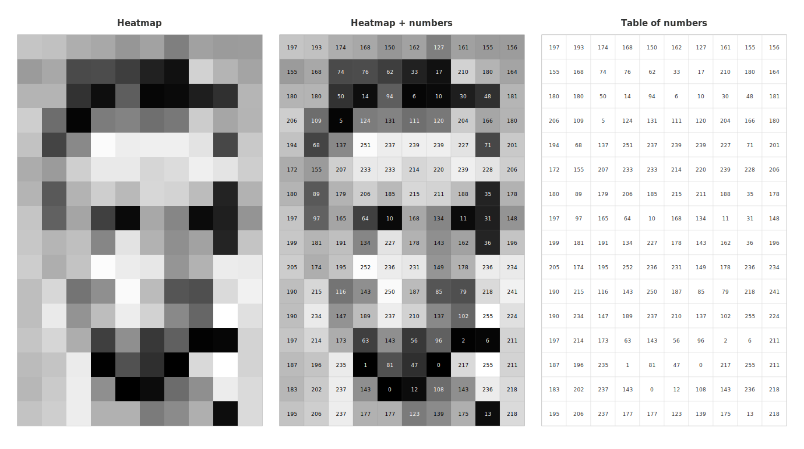

---

# Anscombe's quartet

<div class="warning-box" data-title="Statistics can deceive">

These four datasets have **identical** summary statistics (same mean, variance, correlation, and regression line) — but look completely different when plotted!

</div>

<p style="text-align: center;">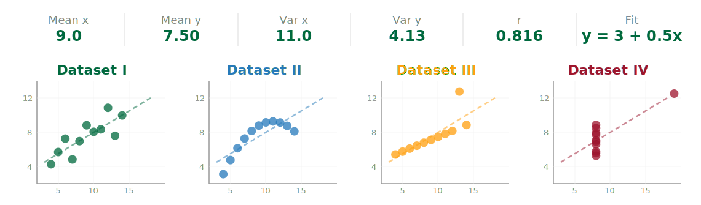</p>

---

# The most important question

<div class="important-box" data-title="Always ask yourself:">

**What message do you want your audience to take away?**

Every visualization decision — color, layout, chart type, annotation — should serve that message. **Start with the message, then choose the visualization.**

</div>

<div class="tip-box" data-title="A common mistake">

Many people pick a chart type first, then try to fit their data into it. Instead, decide what you want to *say*, then find the visualization that says it most clearly.

</div>

---
<!-- _class: scale-90 -->

# Design principles

<div class="tip-box" data-title="Guidelines for effective figures">

- **Data-to-ink ratio** ([Tufte](https://www.edwardtufte.com/tufte/books_vdqi)): maximize the share of ink devoted to data; minimize non-data ink (gridlines, borders, decorations)
- **Clarity over cleverness**: if the audience has to work to understand your figure, simplify it
- **Consistent encoding**: same color = same meaning throughout your presentation
- **Accessible design**: use [colorblind-friendly palettes](https://www.nature.com/articles/nmeth.1618); don't rely on color alone
- **Label everything**: axes, units, legends — if someone can't understand the figure without your narration, add more labels
- **Be willing to break all of the rules!** Sometimes the most effective figure violates a guideline

</div>

---
<!-- _class: scale-90 -->

# Grammar of graphics: figures are built from layers


*Based on Wickham's [A layered grammar of graphics](https://www.dropbox.com/s/xhpjth2f4aamn5u/layered-grammar.pdf) and Wilkinson's [The grammar of graphics](https://www.dropbox.com/s/4qwd16psogqdgi6/Wilk10.pdf)*

---
<!-- _class: scale-90 -->

# Choosing the right visualization

<div class="tip-box" data-title="Match the chart to your data and message">

| If you want to... | Consider... |
|-|-|
| **Compare categories** | Bar chart, grouped bar, stacked bar |
| **Show distributions** | Histogram, density plot, violin, box plot, strip plot |
| **Reveal relationships** | Scatter plot, bubble chart, heatmap, pair plot |
| **Track change over time** | Line plot, area chart, sparkline |
| **Show composition** | Pie chart, stacked area, treemap |
| **Display spatial data** | Choropleth map, bubble map |
| **Show connections** | Network graph, chord diagram, Sankey diagram |
| **Add a dimension** | Animation, 3D projection, vary size/color/markers/style |

</div>

---

# Bar chart: comparing values across categories

```chart
type: bar
labels: Spring, Summer, Autumn, Winter
data: 42, 78, 55, 31
caption: Average daily visitors by season
ylabel: Visitors
palette: cdl
height: 420px
```

---
<!-- _class: scale-90 -->

# Grouped bar chart: comparing subcategories

```chart
type: bar
labels: 2022, 2023, 2024, 2025
datasets:
  - label: Undergrad
    data: 320, 345, 410, 390
  - label: Masters
    data: 85, 92, 105, 110
  - label: Doctoral
    data: 45, 48, 50, 52
palette: cdl
caption: Course enrollment by year and group
ylabel: Number of students
height: 380px
```

---

# Histogram: showing the shape of a distribution

```chart
type: bar
labels: 0–10, 10–20, 20–30, 30–40, 40–50, 50–60, 60–70, 70–80, 80–90, 90–100
data: 2, 5, 12, 25, 35, 30, 20, 10, 6, 3
caption: Distribution of exam scores (n = 148)
xlabel: Score
ylabel: Count
palette: cdl
height: 380px
```

---

# Box plot and violin plot: revealing distribution shape

<p style="text-align: center;">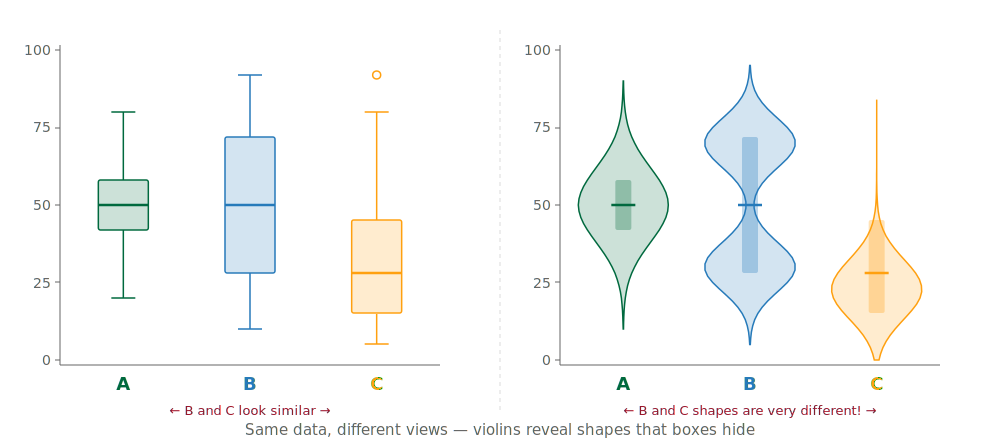</p>

---

# Scatter plot: revealing relationships between variables

<p style="text-align: center;">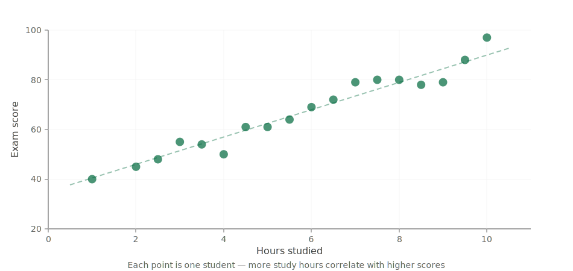</p>

---

# Heatmap: showing magnitude in a matrix

<p style="text-align: center;"></p>

---

# Line plot: tracking change over time

```chart
type: line
labels: Jan, Feb, Mar, Apr, May, Jun, Jul, Aug, Sep, Oct, Nov, Dec
datasets:
  - label: 2024
    data: 12, 15, 22, 28, 35, 42, 45, 43, 38, 28, 18, 14
  - label: 2025
    data: 14, 18, 25, 32, 40, 48, 50, 47, 40, 30, 20, 15
palette: cdl
caption: Average temperature (°C) by month
xlabel: Month
ylabel: Temperature (°C)
height: 380px
```

---

# Area chart: emphasizing cumulative magnitude

```chart
type: line
labels: 2020, 2021, 2022, 2023, 2024, 2025
datasets:
  - label: Solar
    data: 10, 18, 30, 45, 62, 85
  - label: Wind
    data: 25, 32, 38, 45, 55, 68
  - label: Hydro
    data: 40, 42, 43, 44, 45, 46
palette: cdl
alpha: 0.4
caption: Renewable energy capacity (GW) — area charts emphasize cumulative growth
ylabel: Capacity (GW)
height: 360px
```

---
<!-- _class: scale-80 -->

# Pie chart: parts of a whole (use sparingly!)

```chart
type: pie
labels: Python, R, SQL, Julia, Other
data: 45, 20, 18, 7, 10
caption: Programming languages used in data science (2025 survey)
palette: cdl
height: 350px
```

<div class="warning-box" data-title="Pie charts are controversial">

Humans are bad at comparing **angles and areas**. Bar charts are almost always more readable. Use pie charts only when you have **few categories** (≤5) and want to emphasize that they **sum to 100%**.

</div>

---

# Doughnut chart: an alternative to pie (with many of the same issues)

```chart
type: doughnut
labels: Tuition, Research, Grants, Donations, Other
data: 35, 25, 20, 12, 8
caption: University revenue sources (%)
palette: cdl
height: 400px
```

---
<!-- _class: scale-80 -->

# Choropleth map: coloring regions by value

<p style="text-align: center;">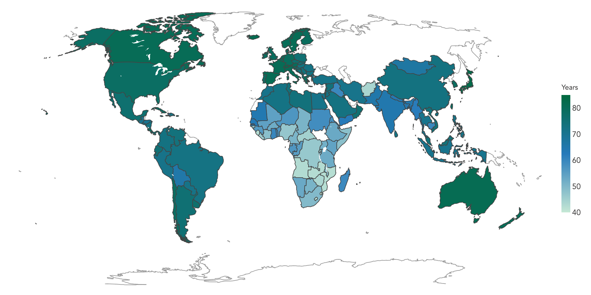</p>

<div class="note-box" data-title="Life expectancy by country (2007)">

Color intensity encodes magnitude. Great for showing regional variation — but large, sparsely populated areas can dominate visually.

</div>

---

# Animation: life expectancy vs. GDP over time

<div class="note-box" data-title="Hans Rosling's Gapminder">

This famous visualization — popularized by [Hans Rosling](https://www.gapminder.org/) — shows how life expectancy and GDP per capita have changed across countries from 1952 to 2007. Bubble size = population; color = continent.

</div>


---
<!-- _class: scale-80 -->

# Network graph: showing connections between entities

<p style="text-align: center;">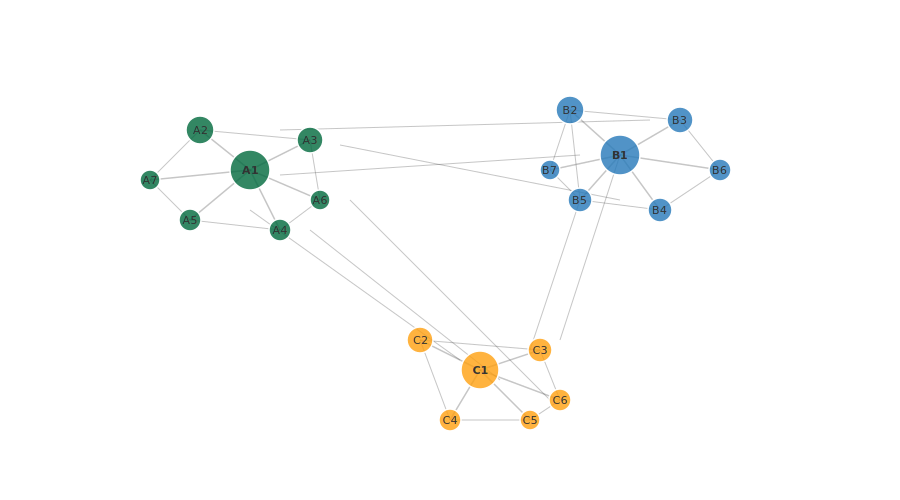</p>

---
<!-- _class: scale-80 -->

# Nightingale's rose diagram (1858)

<p style="text-align: center;">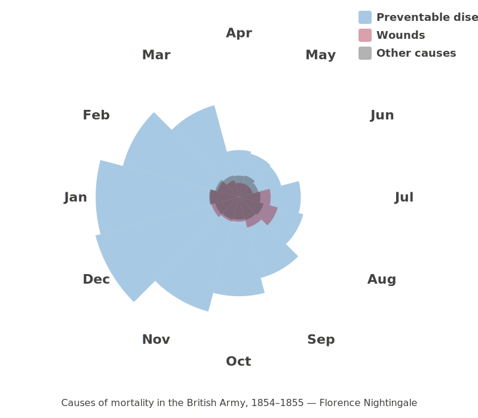</p>

<div class="note-box" data-title="Data visualization can save lives!">

Nightingale's chart convinced the British army to prioritize sanitation — saving thousands of lives.

</div>

---
<!-- _class: scale-70 -->

# Snow's cholera map (1854)

<p style="text-align: center;">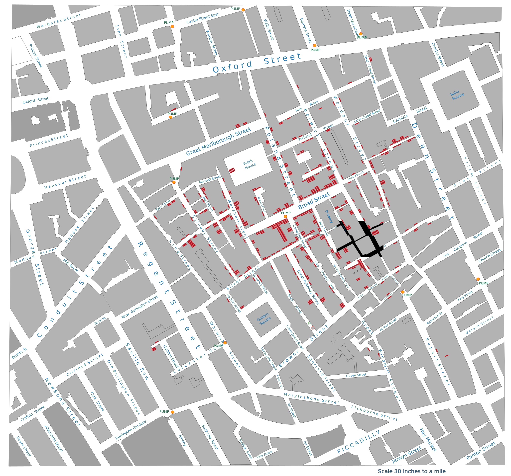</p>

<div class="note-box" data-title="Founding modern epidemiology">

Deaths clustered around the Broad Street pump — disproving the "miasma" theory and proving cholera was waterborne.

</div>

---
<!-- _class: scale-80 -->

# Minard's map of Napoleon's Russian campaign (1869)

<p style="text-align: center;">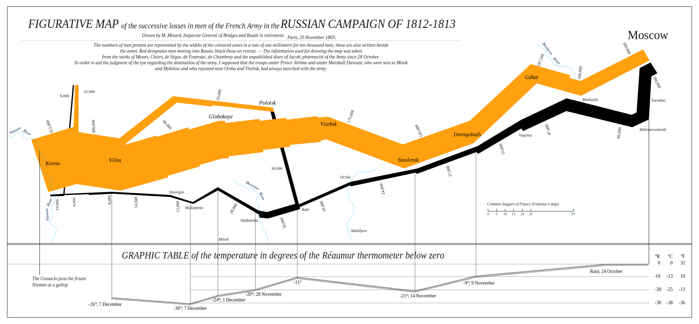</p>

<div class="tip-box" data-title="&quot;The best statistical graphic ever drawn&quot;">

Six variables in one image: army size, location, direction, temperature, latitude, and longitude. — [Edward Tufte](https://www.edwardtufte.com/tufte/posters)

</div>

---
<!-- _class: scale-60 -->

# The periodic table (1869): organizing all known matter

<p style="text-align: center;">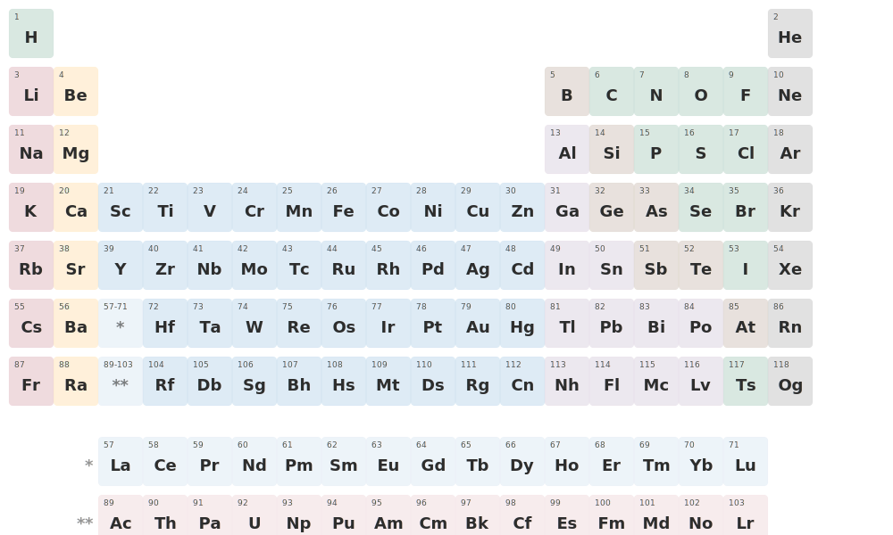</p>

<div class="note-box" data-title="A visualization that predicted the future">

Mendeleev's arrangement revealed patterns in chemical properties — and predicted elements that hadn't been discovered yet.

</div>

---
<!-- _class: scale-75 -->

# Radar plots: visualize many dimensions at once

<p style="text-align: center;"><span style="display: inline-block; background: white; border: 1px solid #333; border-radius: 12px; padding: 8px; box-shadow: 0 2px 8px rgba(0,0,0,0.1);">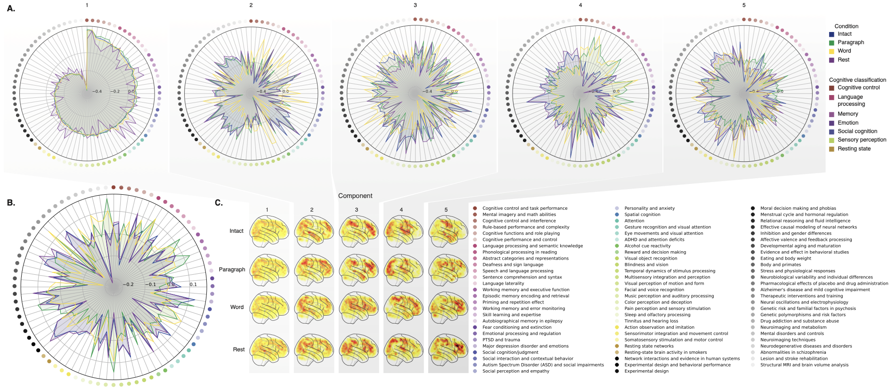</span></p>

<div class="note-box" data-title="What does it mean?">

Each point along the circumference of a radar plot denotes a different variable (dimension). Distance from the center encodes magnitude. The shape of the resulting polygon reveals patterns across dimensions.

Source: [Owen et al., (2024)](https://www.pnas.org/doi/10.1073/pnas.2400082121)

</div>

---

# Questions? Want to chat more?

<div class="emoji-figure">
  <div class="emoji-col">
    <span class="emoji emoji-xl emoji-bg emoji-bg-navy">&#x1F4E7;</span>
    <span class="label"><a href="mailto:jeremy@dartmouth.edu">Email</a> me</span>
  </div>
  <div class="emoji-col">
    <span class="emoji emoji-xl emoji-bg emoji-bg-purple">&#x1F4AC;</span>
    <span class="label">Join our <a href="https://stories-about-data.slack.com">Slack</a></span>
  </div>
  <div class="emoji-col">
    <span class="emoji emoji-xl emoji-bg emoji-bg-green">&#x1F481;</span>
    <span class="label">Come to <a href="https://context-lab.com/scheduler">office hours</a></span>
  </div>
</div>

<div class="note-box" data-title="Up next...">

- **Thursday (X-hour):** Vibe coding tips and tricks!
- **Friday:** Workshop data story ideas + Assignment 2 release

</div>
